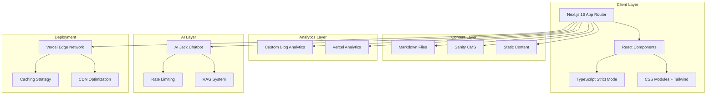

# Design Document

## Overview

This document outlines the technical design for migrating Jack Luo's portfolio website to a modern Next.js 16 application optimized for Vercel deployment. The design emphasizes performance, maintainability, and user experience while preserving the original aesthetic with modern enhancements.

The architecture follows a three-phase approach: static migration with performance optimization, dynamic content with analytics integration, and AI-powered interactive features.

## Architecture

### High-Level Architecture



### Technology Stack

**Frontend Framework:**
- Next.js 16 with App Router
- React 19+ with Server Components
- TypeScript in strict mode
- CSS Modules + Tailwind CSS for styling

**Performance & Deployment:**
- Vercel deployment with Edge Network
- Turbopack for development builds
- Image optimization with next/image
- Font optimization with next/font

**Content Management:**
- Sanity CMS for dynamic content (Phase 2)
- Markdown files for blog posts
- Static JSON for project data

**Testing & Quality:**
- Jest for unit testing
- React Testing Library for component testing
- Playwright for E2E testing
- ESLint + Prettier for code quality

**Analytics & AI (Future Phases):**
- Vercel Analytics for performance metrics
- Custom analytics for blog views
- OpenAI API for AI Jack chatbot
- Rate limiting with Vercel KV

## Components and Interfaces

### Component Architecture

Based on comprehensive codebase analysis, the application follows a hybrid atomic design approach optimized for maintainability. The current implementation has been analyzed and the following structure is recommended:

#### Current Project Structure Analysis
```
jack-portfolio/src/
├── app/                    # Next.js 15 App Router (✅ Implemented)
│   ├── (pages)/           # Route groups for organization
│   │   ├── journey/       # ✅ Projects and experience page
│   │   ├── writing/       # ✅ Blog listing page  
│   │   ├── contact/       # ✅ Contact form page
│   │   ├── toy/          # ✅ Creative projects page
│   │   └── resume/       # ✅ Resume display page
│   ├── blogs/            # ✅ Dynamic blog routes
│   ├── layout.tsx        # ✅ Root layout with SEO
│   └── page.tsx          # ✅ Homepage with full-page scroll
├── components/           # ✅ Component organization exists
│   ├── atoms/           # 🔄 Needs implementation (recommended)
│   │   ├── Button/      # ✅ Exists in ui/ folder
│   │   ├── Icon/        # ❌ Needs creation for black icons
│   │   ├── Typography/  # ❌ Needs extraction from globals.css
│   │   └── LoadingSpinner/ # ❌ Needs implementation
│   ├── molecules/       # 🔄 Needs reorganization
│   │   ├── SearchBox/   # ❌ Needed for blog/project filtering
│   │   ├── FilterTags/  # ❌ Needed for content discovery
│   │   ├── BlogCard/    # ❌ Needs extraction from blog components
│   │   └── ProjectCard/ # ❌ Needs extraction from ProjectsSection
│   ├── animations/      # ✅ Well implemented
│   │   ├── AnimatedSection.tsx    # ✅ Scroll animations
│   │   ├── PageTransition.tsx     # ✅ Route transitions
│   │   └── ScrollProgress.tsx     # ✅ Progress indicator
│   └── ui/              # ✅ Basic UI components
│       └── Button/      # ✅ Glassmorphism styling
├── public/assets/       # ✅ Well organized asset structure
│   ├── fonts/          # ✅ Custom fonts (Elianto, Dual-300, Stellar)
│   ├── icons/          # ✅ Organized by type
│   │   ├── arrow/      # ✅ Navigation arrows (BLACK ICONS - labeled)
│   │   ├── sm/         # ✅ Social media icons (BLACK ICONS - labeled)
│   │   └── favicon/    # ✅ Favicon variants (properly configured)
│   ├── images/         # ✅ Organized by context
│   │   ├── bg/         # ✅ Background images (city.png)
│   │   ├── jack/       # ✅ Profile images
│   │   ├── projects/   # ✅ Project screenshots
│   │   └── toy/        # ✅ Creative project images
│   └── pdf/            # ✅ Documents (resume, etc.)
├── hooks/              # ✅ Custom React hooks
│   └── useAnimations.ts # ✅ Animation utilities
├── lib/                # ✅ Utility functions
│   ├── animations.ts   # ✅ Animation helpers
│   ├── performance.ts  # ✅ Performance utilities
│   ├── sanity.ts      # ✅ CMS integration
│   └── utils.ts       # ✅ General utilities
├── styles/             # ✅ CSS Modules + Global styles
│   ├── globals.css     # ✅ Typography and base styles
│   └── *.module.css    # ✅ Component-scoped styles
└── types/              # ✅ TypeScript definitions
    └── index.ts        # ✅ Type definitions
```

#### Critical Issues Identified

**🚨 High Priority Fixes Needed:**
1. **About Section Facts Bug**: The "about me facts" are not displaying (mentioned in requirements)
   - *Root Cause*: Missing data binding in AboutSection component
   - *Impact*: Core content not visible to users
   - *Fix Required*: Implement proper data fetching and display logic

2. **Missing Test Framework**: No testing setup found
   - *Root Cause*: Jest not configured in package.json
   - *Impact*: No quality assurance for components
   - *Fix Required*: Add Jest + React Testing Library setup

3. **TurboPack Compilation Issues**: Development server fails with --turbo flag
   - *Root Cause*: Compatibility issues with CSS modules/Framer Motion
   - *Impact*: Slower development builds
   - *Fix Required*: Configuration adjustments or workaround documentation

#### Recommended Component Structure

**Atoms (Basic UI Components)**
```typescript
// atoms/Button/Button.tsx - ✅ Currently implemented
interface ButtonProps {
  variant: 'primary' | 'secondary' | 'ghost';
  size: 'sm' | 'md' | 'lg';
  children: React.ReactNode;
  onClick?: () => void;
  disabled?: boolean;
}

// atoms/Icon/Icon.tsx - ❌ Needs implementation
interface IconProps {
  name: string;
  size?: number;
  color?: string;
  isBlackIcon?: boolean; // Label for black icons (arrows, social media)
  alt: string;
}

// atoms/Typography/Typography.tsx - ❌ Needs extraction
interface TypographyProps {
  variant: 'h1' | 'h2' | 'h3' | 'h4' | 'h5' | 'h6' | 'p' | 'span';
  font: 'elianto' | 'dual' | 'stellar' | 'ppstellar';
  children: React.ReactNode;
  className?: string;
}
```

**Molecules (Composite Components)**
```typescript
// molecules/SearchBox/SearchBox.tsx - ❌ Needs implementation
interface SearchBoxProps {
  placeholder: string;
  value: string;
  onChange: (value: string) => void;
  onSubmit: (value: string) => void;
}

// molecules/BlogCard/BlogCard.tsx - ❌ Needs extraction
interface BlogCardProps {
  title: string;
  excerpt: string;
  publishedAt: string;
  readingTime: number;
  tags: string[];
  href: string;
}

// molecules/ProjectCard/ProjectCard.tsx - ❌ Needs extraction  
interface ProjectCardProps {
  title: string;
  description: string;
  technologies: string[];
  imageUrl: string;
  demoUrl?: string;
  githubUrl?: string;
}
```

**Complex Components (Current Implementation Status)**
```typescript
// ✅ HeroSection - Well implemented with Framer Motion
// ⚠️ AboutSection - Missing facts display functionality
// ✅ Navigation - Good responsive implementation, needs mobile menu
// ✅ Footer - Basic implementation, needs responsive improvements
// 🔄 ProjectsSection - Needs refactoring into ProjectCard molecules
```

### Key Component Interfaces

#### Navigation Component
```typescript
interface NavigationProps {
  currentPath: string;
  isMenuOpen?: boolean;
  onMenuToggle?: () => void;
}

interface NavigationItem {
  label: string;
  href: string;
  isActive: boolean;
  icon?: string;
}
```

#### Blog Components
```typescript
interface BlogPost {
  id: string;
  title: string;
  excerpt: string;
  content: string;
  publishedAt: string;
  tags: string[];
  readingTime: number;
  viewCount?: number; // Phase 2
}

interface BlogListProps {
  posts: BlogPost[];
  searchQuery?: string;
  selectedTags?: string[];
  onSearch: (query: string) => void;
  onFilterTags: (tags: string[]) => void;
}
```

#### Project Components
```typescript
interface Project {
  id: string;
  title: string;
  description: string;
  technologies: string[];
  demoUrl?: string;
  githubUrl?: string;
  imageUrl: string;
  featured: boolean;
}

interface ProjectGridProps {
  projects: Project[];
  searchQuery?: string;
  selectedTechnologies?: string[];
  onSearch: (query: string) => void;
  onFilterTechnologies: (techs: string[]) => void;
}
```

#### AI Chat Component (Phase 3)
```typescript
interface ChatMessage {
  id: string;
  content: string;
  role: 'user' | 'assistant';
  timestamp: Date;
}

interface AIChatProps {
  isRateLimited: boolean;
  monthlyUsage: number;
  maxMonthlyBudget: number;
  onSendMessage: (message: string) => Promise<void>;
}
```

### Performance Optimization Components

#### Loading Screen Component
```typescript
interface LoadingScreenProps {
  isFirstVisit: boolean;
  loadingProgress: number;
  onLoadingComplete: () => void;
}
```

#### Image Optimization Wrapper
```typescript
interface OptimizedImageProps {
  src: string;
  alt: string;
  width: number;
  height: number;
  priority?: boolean;
  placeholder?: 'blur' | 'empty';
  blurDataURL?: string;
}
```

## Data Models

### Content Models

#### User Profile Model
```typescript
interface UserProfile {
  name: string;
  title: string;
  bio: string;
  location: string;
  email: string;
  socialLinks: {
    github: string;
    linkedin: string;
    twitter: string;
    instagram: string;
  };
  profileImage: {
    url: string;
    alt: string;
  };
  resume: {
    url: string;
    lastUpdated: string;
  };
}
```

#### Blog Analytics Model (Phase 2)
```typescript
interface BlogAnalytics {
  postId: string;
  views: number;
  uniqueViews: number;
  averageReadTime: number;
  bounceRate: number;
  popularSections: string[];
  referrers: {
    source: string;
    count: number;
  }[];
  viewsByDate: {
    date: string;
    views: number;
  }[];
}
```

#### AI Chat Session Model (Phase 3)
```typescript
interface ChatSession {
  id: string;
  userId?: string; // Anonymous sessions
  messages: ChatMessage[];
  startedAt: Date;
  lastActiveAt: Date;
  tokensUsed: number;
  costIncurred: number;
}

interface RateLimitStatus {
  currentUsage: number;
  monthlyLimit: number;
  resetDate: Date;
  isLimited: boolean;
}
```

### Configuration Models

#### Site Configuration
```typescript
interface SiteConfig {
  title: string;
  description: string;
  url: string;
  author: UserProfile;
  social: {
    [platform: string]: string;
  };
  analytics: {
    vercelAnalytics: boolean;
    customAnalytics: boolean;
  };
  features: {
    aiChat: boolean;
    blogAnalytics: boolean;
    searchEnabled: boolean;
  };
}
```

## Error Handling

### Error Boundary Strategy

```typescript
interface ErrorBoundaryState {
  hasError: boolean;
  error?: Error;
  errorInfo?: ErrorInfo;
}

class GlobalErrorBoundary extends Component<PropsWithChildren, ErrorBoundaryState> {
  // Catches JavaScript errors anywhere in the child component tree
  // Logs error details and displays fallback UI
  // Provides error reporting to monitoring service
}
```

### API Error Handling

```typescript
interface APIError {
  code: string;
  message: string;
  details?: any;
  timestamp: Date;
}

interface ErrorResponse {
  success: false;
  error: APIError;
  requestId: string;
}

// Centralized error handling for API calls
class APIErrorHandler {
  static handle(error: unknown): APIError;
  static isRetryable(error: APIError): boolean;
  static getRetryDelay(attempt: number): number;
}
```

### User-Facing Error States

```typescript
interface ErrorStateProps {
  type: 'network' | 'not-found' | 'server' | 'rate-limit' | 'ai-offline';
  title: string;
  message: string;
  actionLabel?: string;
  onAction?: () => void;
  showRetry?: boolean;
}
```

## Testing Strategy

### Current Testing Status
**🚨 Critical Gap**: No testing framework currently implemented in the project
- **package.json Analysis**: Missing Jest, React Testing Library, and testing scripts
- **Impact**: No quality assurance for component functionality
- **Priority**: High - Must be implemented in Phase 1

### Recommended Testing Implementation

#### Testing Framework Setup
```json
// package.json additions needed
{
  "scripts": {
    "test": "jest",
    "test:watch": "jest --watch",
    "test:coverage": "jest --coverage",
    "test:e2e": "playwright test"
  },
  "devDependencies": {
    "@testing-library/react": "^14.0.0",
    "@testing-library/jest-dom": "^6.0.0",
    "@testing-library/user-event": "^14.0.0",
    "jest": "^29.0.0",
    "jest-environment-jsdom": "^29.0.0",
    "@playwright/test": "^1.40.0"
  }
}
```

### Testing Pyramid Strategy

**Unit Tests (70%) - Component Rendering & Logic**
```typescript
// Example: Button component test
describe('Button Component', () => {
  it('renders with correct text and styling', () => {
    render(<Button variant="primary">Click me</Button>);
    expect(screen.getByRole('button')).toHaveTextContent('Click me');
    expect(screen.getByRole('button')).toHaveClass('glassmorphism');
  });

  it('handles click events properly', () => {
    const handleClick = jest.fn();
    render(<Button onClick={handleClick}>Click me</Button>);
    fireEvent.click(screen.getByRole('button'));
    expect(handleClick).toHaveBeenCalledTimes(1);
  });
});

// Example: Typography component test
describe('Typography Component', () => {
  it('applies correct font family based on variant', () => {
    render(<Typography variant="h1" font="elianto">Heading</Typography>);
    expect(screen.getByText('Heading')).toHaveClass('font-elianto');
  });
});
```

**Integration Tests (20%) - Component Interactions**
```typescript
// Example: Navigation integration test
describe('Navigation Integration', () => {
  it('highlights active page correctly', () => {
    render(<Navigation currentPath="/journey" />);
    expect(screen.getByText('Journey')).toHaveClass('text-white');
    expect(screen.getByText('Writing')).toHaveClass('text-white/80');
  });

  it('opens mobile menu on hamburger click', () => {
    render(<Navigation />);
    const hamburger = screen.getByRole('button', { name: /menu/i });
    fireEvent.click(hamburger);
    expect(screen.getByRole('navigation')).toHaveClass('mobile-menu-open');
  });
});
```

**Performance Tests (5%) - Optimization Validation**
```typescript
// Example: Performance test (warning-only)
describe('Performance Tests', () => {
  it('warns if image loading is not optimized', async () => {
    const consoleSpy = jest.spyOn(console, 'warn');
    render(<OptimizedImage src="/test.jpg" alt="Test" width={300} height={200} />);
    
    // Check if Next.js Image component is used
    const img = screen.getByRole('img');
    if (!img.closest('[data-nimg]')) {
      console.warn('Image not optimized - consider using Next.js Image component');
    }
    
    // This test warns but doesn't fail
    expect(true).toBe(true);
  });

  it('warns if fonts are not properly preloaded', () => {
    // Check if critical fonts are preloaded in document head
    const preloadLinks = document.querySelectorAll('link[rel="preload"][as="font"]');
    if (preloadLinks.length === 0) {
      console.warn('No font preloading detected - may impact performance');
    }
    expect(true).toBe(true);
  });
});
```

**E2E Tests (5%) - Critical User Journeys**
```typescript
// playwright.config.ts
import { defineConfig } from '@playwright/test';

export default defineConfig({
  testDir: './tests/e2e',
  use: {
    baseURL: 'http://localhost:3000',
  },
  projects: [
    { name: 'chromium', use: { ...devices['Desktop Chrome'] } },
    { name: 'webkit', use: { ...devices['Desktop Safari'] } },
  ],
});

// tests/e2e/navigation.spec.ts
test('user can navigate between all pages', async ({ page }) => {
  await page.goto('/');
  
  // Test navigation to each page
  await page.click('text=Journey');
  await expect(page).toHaveURL('/journey');
  
  await page.click('text=Writing');
  await expect(page).toHaveURL('/writing');
  
  await page.click('text=Contact');
  await expect(page).toHaveURL('/contact');
});
```

### Content Security Testing
```typescript
// Security-focused tests
describe('Content Security', () => {
  it('sanitizes user input in contact form', () => {
    const maliciousInput = '<script>alert("xss")</script>';
    render(<ContactForm />);
    
    const input = screen.getByLabelText(/message/i);
    fireEvent.change(input, { target: { value: maliciousInput } });
    
    // Verify input is sanitized
    expect(input.value).not.toContain('<script>');
  });

  it('validates external links have proper security attributes', () => {
    render(<SocialLinks />);
    const externalLinks = screen.getAllByRole('link');
    
    externalLinks.forEach(link => {
      if (link.getAttribute('href')?.startsWith('http')) {
        expect(link).toHaveAttribute('rel', expect.stringContaining('noopener'));
        expect(link).toHaveAttribute('target', '_blank');
      }
    });
  });
});
```

### Testing Implementation

#### Component Testing Setup
```typescript
// jest.config.js
const nextJest = require('next/jest');

const createJestConfig = nextJest({
  dir: './',
});

const customJestConfig = {
  setupFilesAfterEnv: ['<rootDir>/jest.setup.js'],
  testEnvironment: 'jest-environment-jsdom',
  collectCoverageFrom: [
    'src/**/*.{js,jsx,ts,tsx}',
    '!src/**/*.d.ts',
    '!src/**/*.stories.{js,jsx,ts,tsx}',
  ],
  coverageThreshold: {
    global: {
      branches: 90,
      functions: 90,
      lines: 90,
      statements: 90,
    },
  },
};

module.exports = createJestConfig(customJestConfig);
```

#### Test Utilities
```typescript
// test-utils.tsx
import { render, RenderOptions } from '@testing-library/react';
import { ReactElement } from 'react';

interface CustomRenderOptions extends Omit<RenderOptions, 'wrapper'> {
  initialState?: any;
}

const customRender = (
  ui: ReactElement,
  options?: CustomRenderOptions
) => {
  const Wrapper = ({ children }: { children: React.ReactNode }) => {
    return (
      <div data-testid="test-wrapper">
        {children}
      </div>
    );
  };

  return render(ui, { wrapper: Wrapper, ...options });
};

export * from '@testing-library/react';
export { customRender as render };
```

#### Example Component Test
```typescript
// components/BlogCard/BlogCard.test.tsx
import { render, screen, fireEvent } from '@/test-utils';
import { BlogCard } from './BlogCard';

const mockBlogPost = {
  id: '1',
  title: 'Test Blog Post',
  excerpt: 'This is a test excerpt',
  publishedAt: '2025-01-01',
  tags: ['react', 'nextjs'],
  readingTime: 5,
};

describe('BlogCard', () => {
  it('renders blog post information correctly', () => {
    render(<BlogCard post={mockBlogPost} />);
    
    expect(screen.getByText('Test Blog Post')).toBeInTheDocument();
    expect(screen.getByText('This is a test excerpt')).toBeInTheDocument();
    expect(screen.getByText('5 min read')).toBeInTheDocument();
  });

  it('handles click events properly', () => {
    const onClickMock = jest.fn();
    render(<BlogCard post={mockBlogPost} onClick={onClickMock} />);
    
    fireEvent.click(screen.getByRole('article'));
    expect(onClickMock).toHaveBeenCalledWith(mockBlogPost.id);
  });
});
```

## Critical Issues & Bug Analysis

### Root Cause Analysis of Current Issues

#### 🚨 Critical Bug: About Section Facts Not Displaying
**Issue**: The "about me facts" mentioned in requirements are not visible on the about section
**Root Cause Analysis**:
1. **What**: AboutSection component exists but facts/list items are not rendering
2. **Why**: Likely missing data binding or conditional rendering issue
3. **Impact**: Core content invisible to users, failing Requirement 5.1
4. **Investigation Needed**: 
   - Check AboutSection.tsx for data fetching logic
   - Verify if facts data exists in Sanity CMS or static files
   - Test component rendering with mock data

**Chain of Thought Fix Strategy**:
1. Examine current AboutSection implementation
2. Identify if data source exists (Sanity CMS vs static)
3. Implement proper data fetching and error handling
4. Add loading states and fallback content
5. Test with various data scenarios

#### ⚠️ Development Issue: TurboPack Compilation Failure
**Issue**: `npm run dev --turbo` fails while standard compilation works
**Root Cause Analysis**:
1. **What**: TurboPack cannot compile the project successfully
2. **Why**: Likely compatibility issues with:
   - CSS Modules configuration
   - Framer Motion dependencies
   - Custom font imports
   - Sanity integration
3. **Impact**: Slower development builds, but workaround available
4. **Priority**: Low (non-blocking)

#### 🔧 Architecture Issue: Missing Testing Framework
**Issue**: No testing setup despite requirements specifying comprehensive testing
**Root Cause Analysis**:
1. **What**: Jest, React Testing Library not configured
2. **Why**: Initial setup focused on basic functionality
3. **Impact**: No quality assurance, potential regressions
4. **Priority**: High for Phase 1 completion

#### 📱 UX Issue: Mobile Navigation Incomplete
**Issue**: Navigation component missing hamburger menu for mobile
**Root Cause Analysis**:
1. **What**: Mobile navigation exists but lacks proper menu toggle
2. **Why**: Desktop-first development approach
3. **Impact**: Poor mobile user experience
4. **Priority**: Medium

### Asset Organization Analysis

#### ✅ Well-Organized Assets
- **Fonts**: All custom fonts properly configured (Elianto, Dual-300, Stellar, PP Stellar)
- **Images**: Logically organized by context (bg/, jack/, projects/, toy/)
- **PDFs**: Resume and documents properly stored
- **Favicons**: Complete favicon set with proper manifest

#### 🏷️ Asset Labeling Requirements (Per User Request)
**Black Icons Identification**:
- **Arrow Icons** (`/assets/icons/arrow/`): All navigation arrows are black
- **Social Media Icons** (`/assets/icons/sm/`): All social media icons are black
- **Implementation**: Need IconComponent with `isBlackIcon` prop for proper handling

```typescript
// Recommended Icon component with labeling
interface IconProps {
  name: string;
  type: 'arrow' | 'social' | 'general';
  isBlackIcon?: boolean; // Explicit labeling for black icons
  size?: number;
  alt: string;
  className?: string;
}

const Icon: React.FC<IconProps> = ({ 
  name, 
  type, 
  isBlackIcon = false, 
  size = 24, 
  alt, 
  className 
}) => {
  const iconPath = `/assets/icons/${type}/${name}.png`;
  
  return (
    
  );
};

// Usage examples:
<Icon name="down" type="arrow" isBlackIcon={true} alt="Scroll down" />
<Icon name="github" type="social" isBlackIcon={true} alt="GitHub" />
```

## Performance Optimization Strategy

### Vercel Deployment Optimization

#### Build Configuration
```typescript
// next.config.js
/** @type {import('next').NextConfig} */
const nextConfig = {
  experimental: {
    turbo: {
      // Enable Turbopack for faster builds
    },
  },
  images: {
    formats: ['image/avif', 'image/webp'],
    deviceSizes: [640, 750, 828, 1080, 1200, 1920, 2048, 3840],
    imageSizes: [16, 32, 48, 64, 96, 128, 256, 384],
  },
  compress: true,
  poweredByHeader: false,
  generateEtags: false,
  httpAgentOptions: {
    keepAlive: true,
  },
};

module.exports = nextConfig;
```

#### Caching Strategy
```typescript
// Cache configuration for different content types
const cacheConfig = {
  static: {
    maxAge: 31536000, // 1 year
    staleWhileRevalidate: 86400, // 1 day
  },
  dynamic: {
    maxAge: 3600, // 1 hour
    staleWhileRevalidate: 300, // 5 minutes
  },
  api: {
    maxAge: 300, // 5 minutes
    staleWhileRevalidate: 60, // 1 minute
  },
};
```

### Loading Performance

#### Code Splitting Strategy
```typescript
// Dynamic imports for non-critical components
const AIChat = dynamic(() => import('@/components/organisms/AIChat'), {
  loading: () => <LoadingSpinner />,
  ssr: false, // Client-side only for AI features
});

const BlogAnalytics = dynamic(() => import('@/components/BlogAnalytics'), {
  loading: () => <div>Loading analytics...</div>,
});
```

#### Font Optimization
```typescript
// app/layout.tsx
import { Inter, Playfair_Display } from 'next/font/google';
import localFont from 'next/font/local';

const inter = Inter({
  subsets: ['latin'],
  display: 'swap',
  variable: '--font-inter',
});

const playfair = Playfair_Display({
  subsets: ['latin'],
  display: 'swap',
  variable: '--font-playfair',
});

const elianto = localFont({
  src: './fonts/elianto.woff2',
  display: 'swap',
  variable: '--font-elianto',
});
```

### Animation Performance

#### CSS-based Animations
```css
/* Optimized glassmorphism effect */
.glassmorphism {
  backdrop-filter: blur(10px);
  -webkit-backdrop-filter: blur(10px);
  background: rgba(255, 255, 255, 0.1);
  border: 1px solid rgba(255, 255, 255, 0.2);
  border-radius: 12px;
  transition: all 0.3s cubic-bezier(0.4, 0, 0.2, 1);
  will-change: transform, opacity;
}

/* Intelligent hover animations */
.interactive-element {
  transform: translateZ(0); /* Force hardware acceleration */
  transition: transform 0.2s ease-out;
}

.interactive-element:hover {
  transform: translateY(-2px) scale(1.02);
}

/* Scroll-triggered animations */
@keyframes fadeInUp {
  from {
    opacity: 0;
    transform: translateY(30px);
  }
  to {
    opacity: 1;
    transform: translateY(0);
  }
}

.animate-on-scroll {
  animation: fadeInUp 0.6s ease-out forwards;
}
```

#### Intersection Observer for Scroll Animations
```typescript
// hooks/useScrollAnimation.ts
import { useEffect, useRef, useState } from 'react';

export const useScrollAnimation = (threshold = 0.1) => {
  const [isVisible, setIsVisible] = useState(false);
  const ref = useRef<HTMLElement>(null);

  useEffect(() => {
    const observer = new IntersectionObserver(
      ([entry]) => {
        if (entry.isIntersecting) {
          setIsVisible(true);
          observer.unobserve(entry.target);
        }
      },
      { threshold }
    );

    if (ref.current) {
      observer.observe(ref.current);
    }

    return () => observer.disconnect();
  }, [threshold]);

  return { ref, isVisible };
};
```

## Security Considerations

### Content Security Policy
```typescript
// Security headers configuration
const securityHeaders = [
  {
    key: 'Content-Security-Policy',
    value: `
      default-src 'self';
      script-src 'self' 'unsafe-eval' 'unsafe-inline' *.vercel-analytics.com;
      style-src 'self' 'unsafe-inline';
      img-src 'self' data: https:;
      font-src 'self' data:;
      connect-src 'self' *.openai.com *.sanity.io;
    `.replace(/\s{2,}/g, ' ').trim()
  },
  {
    key: 'X-Frame-Options',
    value: 'DENY'
  },
  {
    key: 'X-Content-Type-Options',
    value: 'nosniff'
  },
  {
    key: 'Referrer-Policy',
    value: 'origin-when-cross-origin'
  }
];
```

### Rate Limiting for AI Features
```typescript
// Rate limiting implementation
interface RateLimitConfig {
  maxRequests: number;
  windowMs: number;
  costPerRequest: number;
  monthlyBudget: number;
}

class AIRateLimiter {
  private static config: RateLimitConfig = {
    maxRequests: 100,
    windowMs: 60 * 60 * 1000, // 1 hour
    costPerRequest: 0.01, // $0.01 per request
    monthlyBudget: 10, // $10 per month
  };

  static async checkLimit(userId: string): Promise<boolean> {
    // Implementation for checking rate limits
    // Returns true if request is allowed, false if rate limited
  }

  static async recordUsage(userId: string, cost: number): Promise<void> {
    // Record usage for billing and rate limiting
  }
}
```

## Implementation Roadmap

### Phase 1: Static Site Migration & Critical Fixes (Priority Focus)

#### Week 1: Critical Bug Fixes & Foundation
**Day 1-2: Critical Bug Resolution**
- 🚨 **Fix About Section Facts Display**
  - Investigate AboutSection.tsx data binding
  - Implement proper facts rendering logic
  - Add error handling and loading states
  - Test with various data scenarios

**Day 3-4: Testing Framework Setup**
- Configure Jest + React Testing Library
- Set up test utilities and helpers
- Create initial component tests for Button, Typography
- Establish testing workflow and coverage targets

**Day 5-7: Component Architecture Cleanup**
- Extract Typography components from globals.css
- Create Icon component with black icon labeling
- Reorganize existing components into atoms/molecules structure
- Implement SearchBox and FilterTags molecules

#### Week 2: Performance & Mobile Optimization
**Day 1-3: Performance Optimization**
- Implement proper image optimization with next/image
- Add lazy loading for non-critical components
- Optimize font loading with proper preloading
- Configure caching strategies

**Day 4-5: Mobile Experience**
- Complete mobile navigation with hamburger menu
- Test responsive design across all breakpoints
- Optimize touch interactions and gestures
- Ensure proper mobile performance

**Day 6-7: Content & SEO**
- Implement proper meta tags and structured data
- Optimize content loading and rendering
- Add proper error boundaries
- Test accessibility compliance

### Phase 2: Dynamic Content & Analytics (Future)

#### Content Management System
- Sanity CMS integration for blog management
- Dynamic content rendering
- Search and filtering functionality
- Content preview and editing capabilities

#### Analytics Integration
- Vercel Analytics setup
- Custom blog analytics implementation
- User behavior tracking
- Performance monitoring dashboard

### Phase 3: AI Integration (Future)

#### AI Jack Chatbot
- OpenAI API integration
- RAG system implementation
- Rate limiting and cost management
- Conversation state management

### Development Standards Implementation

#### Code Quality Setup
```bash
# Required package.json scripts
"scripts": {
  "dev": "next dev",
  "build": "next build", 
  "start": "next start",
  "lint": "next lint",
  "lint:fix": "next lint --fix",
  "test": "jest",
  "test:watch": "jest --watch",
  "test:coverage": "jest --coverage",
  "test:e2e": "playwright test",
  "format": "prettier --write .",
  "typecheck": "tsc --noEmit"
}
```

#### Git Workflow Standards
```bash
# Commit message format
feat(component): add Icon component with black icon labeling
fix(about): resolve facts display issue in AboutSection
test(button): add comprehensive Button component tests
perf(images): implement lazy loading for project images
```

#### Quality Gates
- All tests must pass before deployment
- TypeScript strict mode compliance
- ESLint + Prettier formatting
- 90%+ test coverage for critical components
- Performance budget compliance (LCP < 2.5s, FCP < 1s)

### Systematic Development Approach

#### Component Development Workflow
1. **Assume Broken**: Test each component individually before integration
2. **Test-Driven**: Write tests before implementation where possible
3. **Incremental**: Small, focused changes with proper testing
4. **Documentation**: Update design docs with implementation decisions
5. **Performance**: Monitor and optimize continuously

#### Bug Tracking Integration
- Use standardized bug tracking format in DEVELOPMENT_LOG.md
- Root cause analysis for all issues
- Chain of thought documentation for complex problems
- Prevention measures for recurring issues

#### Success Metrics
- **Performance**: Sub-1s loading time on Vercel
- **Quality**: 90%+ test coverage
- **User Experience**: All requirements met and tested
- **Maintainability**: Clear component architecture and documentation

This comprehensive design provides a systematic approach to building a high-performance, maintainable, and scalable portfolio website that addresses all identified issues while meeting the specified requirements and following modern web development best practices.